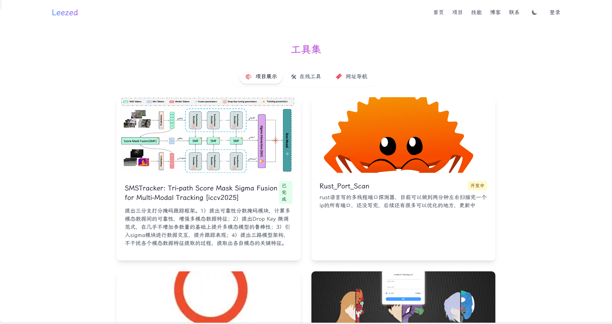
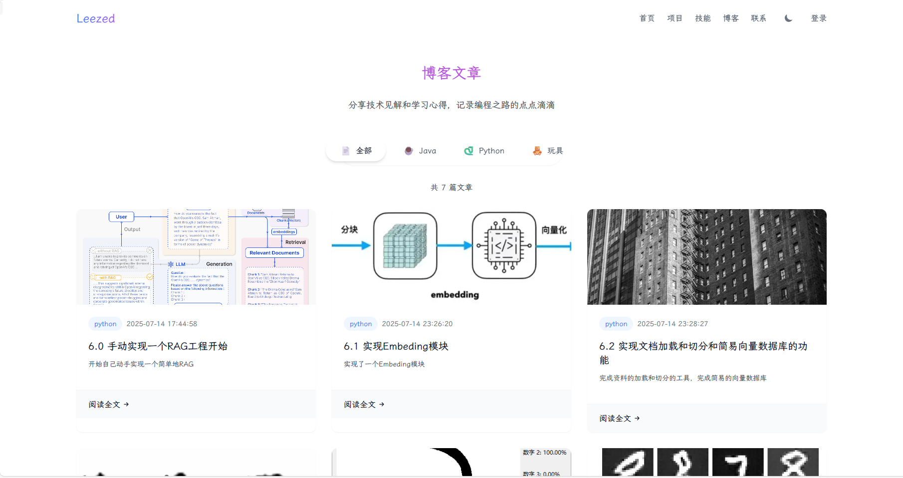
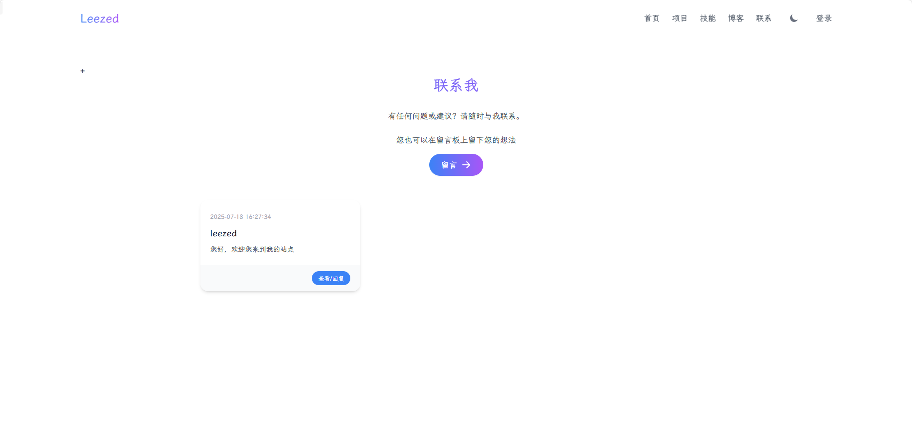

# LeeSite

个人网站

# 效果展示









# 功能

目前网站支持项目展示、博文展示和留言功能。

# 技术栈
前端(前台)使用 Vue3 + Element Plus ，前端（后台）使用 Vue2 + Element UI，后端使用 Spring Boot + MyBatis-Plus。

# 目录结构
```
├── home-for-vue  # 前端（前台）代码
│   ├── src
│   └── ...
├── RuoYi-Vue  # 后端代码
│   ├── lee-site
│   ├── ruoyi-admin
│   ├── ruoyi-common
│   ├── ruoyi-ui # 前端（后台）代码
│   └── ...
├── README.md  # 项目说明
├── update.md  # 更新日志

```


# 后续更新想法

1. 想把自己写的rust_port_scanner集成到网站上，提供在线端口扫描功能
2. 想把自己写的RAG也搬上去，但是我的服务器性能太差了，有点困难，故这个功能等什么时候升级了服务器的配置再说
3. 再找找有没有什么华丽呼哨的功能可以加上去 

